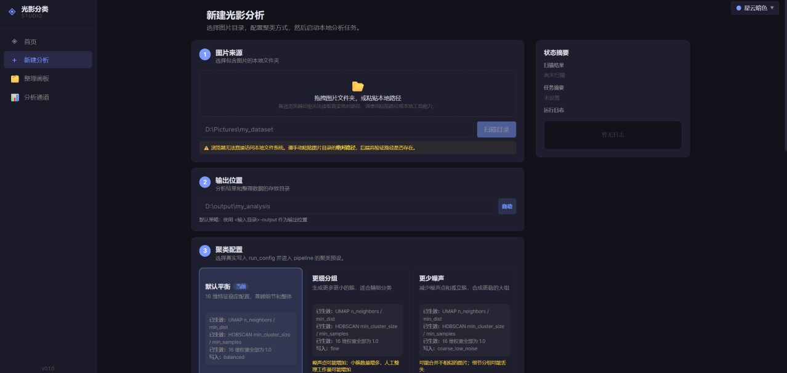
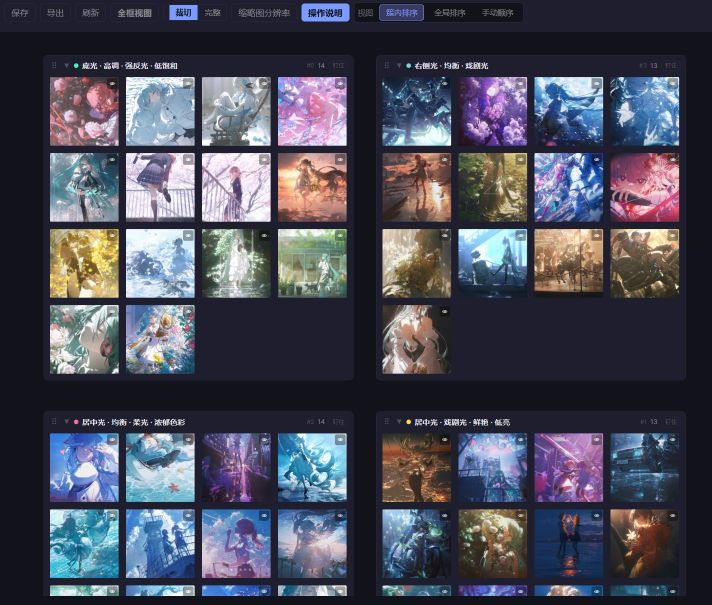
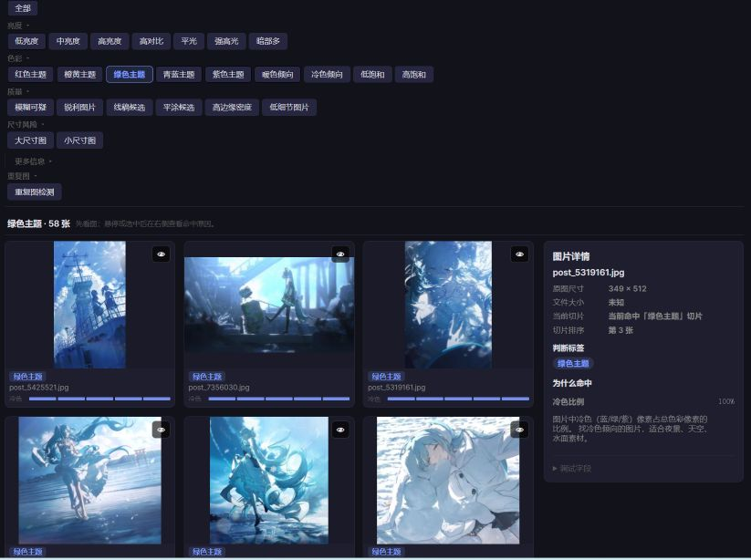

> 🌐 Language switching supported in the web UI — click the `English` / `中文` button in the top nav bar.
> Web 界面支持中英文切换，点击顶部导航栏的 `English` / `中文` 按钮即可。

---

**English** | [中文版 ↓](#chinese)

---

# Dataset Intelligence Studio

A **local-first** image dataset analysis, clustering, inspection, organization, and export tool.  
Designed for quick dataset curation before LoRA / style model training.

> ⚡ Privacy-first: all processing happens locally. No images are uploaded anywhere.

---

## Quick Start

### One-Click Launch (Recommended)

| Platform | Command |
|----------|---------|
| Windows (venv) | `START_VENV.bat` |
| Windows (system Python) | `START_LOCAL.bat` |
| macOS / Linux setup | `scripts/setup_unix.sh` |
| macOS / Linux start | `./start.sh` |

The launcher will:
1. Check prerequisites (Python, Node.js, npm)
2. Verify `.setup/installed.json` still matches the current `requirements*.txt` and frontend package files
3. Check local Python imports for the active interpreter
4. Start backend + frontend, then open the browser at `http://localhost:5173`

### Manual Setup

```bash
# Backend
python -m venv .venv
# Windows: .venv\Scripts\activate
# macOS/Linux: source .venv/bin/activate
pip install -r requirements.txt
python -m uvicorn studio.api.app:app --reload

# Frontend (separate terminal)
cd studio/frontend_react
npm install
npm run dev
```

Open the URL shown by Vite (default: `http://localhost:5173`).

### Startup and Dependency Setup

First time, or after changing dependencies:

```bat
scripts\setup_windows.bat
```

On macOS / Linux:

```bash
bash scripts/setup_unix.sh
```

Daily startup:

```bat
START_VENV.bat
```

or:

```bat
START_LOCAL.bat
```

On macOS / Linux:

```bash
./start.sh
```

The setup script writes `.setup/installed.json` after a successful install. After that, daily startup only checks local hashes and importability; it does not run `pip install` or `npm install` unless you rerun setup.

---

## Features

### 1. New Analysis
- Input local image directory, auto-suggest output path
- Cluster presets: balanced, finer groups, less noise, color/hue bias, brightness bias, custom
- Import / export analysis config (`run_config.json`)

### 2. Visual Feature Extraction & Clustering
- **16-dim interpretable visual features**: brightness, lighting, color, spatial lighting
- **UMAP** dimensionality reduction + **HDBSCAN** clustering
- Configurable feature weights, UMAP / HDBSCAN parameters
- Clustering results go to the Organize Board for manual refinement

### 3. Image Inspection
Browse images by visual slices:

| Group | Slices |
|-------|--------|
| **Brightness** | Low / Medium / High brightness, High contrast, Flat light, Strong highlight, Dark shadow |
| **Color** | Red / Orange-Yellow / Green / Blue-Cyan / Purple theme, Warm / Cool tone, Low / High saturation |
| **Quality** | Blur suspect, Sharp, Lineart candidate, Flat color candidate, High edge density, Low detail |
| **Size** | Large / Small images |
| **Duplicates** | Exact and near-duplicate detection |

### 4. Export Queue
- Export current slice, selected images, or combined filters
- Batch export with rename templates
- Writes `export_manifest.json` to record all export metadata

### 5. Organize Board
- Canvas-based cluster view with drag-and-drop
- Cross-cluster image movement
- Cluster sidebar for quick targeting
- Pin images, save layout, export final groups
- Alt + scroll to zoom, scroll to resize thumbnails

---

## Output Files

| File | Description |
|------|-------------|
| `run_config.json` | Full analysis configuration (features, UMAP, HDBSCAN, channels) |
| `image_index.json` | Image identity: ID, path, dimensions, file size, thumbnail info |
| `features.csv` | 16-dim visual features per image |
| `inspection_manifest.json` | Inspection slice data, sorting, hit results |
| `export_manifest.json` | Export records: source, rename mapping, original paths |
| `requirements.generated.txt` | Auto-generated dependency audit from Python source imports |
| `DEPENDENCY_AUDIT_CN.md` | Human-readable dependency audit report |
| `.setup/installed.json` | Local install marker written by `scripts\setup_windows.bat` |

---

## Tech Stack

- **Backend**: Python + FastAPI + Uvicorn + scikit-learn (UMAP, HDBSCAN)
- **Frontend**: React + TypeScript + Vite + react-grid-layout
- **Image Processing**: Pillow, NumPy, OpenCV
- **i18n**: Built-in bilingual dictionary (Chinese / English) with UI toggle

---

## Development

```bash
# Frontend build & lint
cd studio/frontend_react
npm run build
npm run lint

# Optional dev/test deps
pip install -r requirements-dev.txt

# Backend tests
cd studio
pytest tests/

# Dependency audit
python scripts/audit_python_deps.py
```

---

## License

This project uses a **non-commercial source-available license**.  
Personal learning, research, and non-commercial modifications are permitted.  
Commercial use is prohibited. See the `LICENSE` file for details.

---

## Known Limitations

- UI is Chinese-first (i18n structure is ready for English contributions)
- Large image previews may be slow
- Duplicate detection is conservative (auto-dedup export TBD)
- Inspection does not yet support complex OR/NOT queries
- Full test suite may require optional local models or sample data

---

<a name="chinese"></a>

---

# 🇨🇳 光影分类 / Dataset Intelligence Studio

本地优先的图像数据集分析、聚类、巡检、整理与导出工具。  
适合在 LoRA / 风格模型训练前，对图片数据集做快速筛选、分组、重命名和导出。

> 🔒 本地处理优先：图片不需要上传到远程服务器。分析结果写入本地输出目录。

---

## 1. 一键启动（推荐）

| 平台 | 命令 |
|------|------|
| Windows（虚拟环境） | `START_VENV.bat` |
| Windows（系统 Python） | `START_LOCAL.bat` |
| macOS / Linux | `./start.sh` |

启动器会自动检测环境 → 安装依赖（仅首次） → 启动前后端 → 打开浏览器。

### 手动安装

```bash
# 项目根目录创建虚拟环境
python -m venv .venv
.venv\Scripts\activate        # Windows
# source .venv/bin/activate   # macOS / Linux
pip install -r requirements.txt

# 启动后端
python -m uvicorn studio.api.app:app --reload

# 新终端启动前端
cd studio/frontend_react
npm install
npm run dev
```

浏览器打开 `http://localhost:5173`

---

## 2. 快速使用

1. 打开"新建光影分析"
2. 选择或粘贴图片目录
3. 确认输出目录
4. 选择聚类配置：全维度平衡、更细分组、更少噪声、偏色彩/色调、偏明暗/光照、自定义
5. 点击"开始本地分析"
6. 在"图片巡检"里按亮度、色彩、质量、尺寸风险、重复图筛选图片
7. 把需要的图片加入导出队列
8. 在"整理画板"里拖拽图片、调整簇、保存并导出

---

## 3. 截图

> 截图放在 `docs/screenshots/` 目录，提交到仓库后自动显示。







---

## 4. 主要功能

### 新建光影分析
- 支持本地图片目录输入，自动建议输出目录
- 聚类预设 + 自定义配置
- 导入/导出分析配置
- 输出 `run_config.json`，方便复现参数

### 视觉特征与聚类
- 16 维可解释视觉特征（亮度、光影、颜色、空间光）
- UMAP 降维 + HDBSCAN 聚类
- 特征权重、UMAP 参数、HDBSCAN 参数可配置
- 聚类结果进入整理画板继续人工调整

### 图片巡检
| 分组 | 切片 |
|------|------|
| 亮度 | 低/中/高亮度、高对比、平光、强高光、暗部多 |
| 色彩 | 红/橙黄/绿/青蓝/紫主题、暖/冷色倾向、低/高饱和 |
| 质量 | 模糊可疑、锐利、线稿候选、平涂候选、高边缘密度、低细节 |
| 尺寸 | 大/小尺寸图、竖图/横图/方图、透明图、过曝/死黑可疑 |
| 重复 | 完全重复 + 近似重复检测 |

### 导出队列
- 当前切片导出 / 选中图片导出 / 组合筛选导出
- 支持按排序重命名，自定义命名模板
- 导出原图 + 写出 `export_manifest.json`

### 整理画板
- 画板式查看聚类结果，拖拽图片跨簇移动
- 簇列表快速投放 / 原图预览 / 全框视图
- 画布平移 / 滚轮缩放 / 保存位置
- 保存当前分组 + 最终导出

**整理画板操作表：**

| 操作 | 作用 |
|------|------|
| 滚轮 | 调整图片显示大小 |
| Alt + 滚轮 | 缩放整个画板视角 |
| 拖动画板空白处 | 平移画布 |
| 拖动簇标题 | 移动簇卡片位置 |
| 拖动图片 | 把图片移动到其他簇 |
| 按 `[` / `]` | 缩放画板视角 |
| 按 `0` | 重置画板缩放 |
| 点击眼睛 👁 | 打开原图大图预览 |
| 点击背景 / ESC | 关闭大图预览 |
| 全框视图 | 一次看到所有簇 |

---

## 5. 输出文件说明

| 文件 | 说明 |
|------|------|
| `run_config.json` | 完整分析配置：聚类预设、16 维特征权重、UMAP/HDBSCAN 参数、通道设置 |
| `image_index.json` | 图片身份信息：image_id、路径、尺寸、文件大小、缩略图 |
| `features.csv` | 每张图片的视觉特征 |
| `inspection_manifest.json` | 巡检通道、切片、排序和命中结果 |
| `export_manifest.json` | 导出记录：导出模式、原始文件名、导出文件名、排序、切片 |

---

## 6. 开发命令

```bash
cd studio/frontend_react
npm run build    # 前端构建
npm run lint     # 前端 lint

cd studio
pytest tests/    # 后端测试
```

---

## 7. License

非商业源码可见许可证。  
允许个人学习、研究和非商业修改，禁止商业使用。详见 `LICENSE` 文件。

---

## 项目结构 / Project Structure

```
├── START_VENV.bat              # Windows 一键启动（venv）
├── START_LOCAL.bat             # Windows 一键启动（系统 Python）
├── start.sh                    # Linux / macOS 启动脚本
├── scripts/
│   ├── app_launcher.py         # 主启动器（检测环境、安装依赖、启动服务）
│   ├── reset_local_state.py    # 重置运行时状态
│   ├── export_clean.py         # 打包干净的项目导出
│   └── smoke_test.py           # 启动器组件测试
├── studio/
│   ├── api/                    # FastAPI 后端
│   │   ├── app.py              # 主入口
│   │   ├── schemas.py          # 数据模型
│   │   ├── organize_state.py   # 整理画板状态管理
│   │   └── routers/            # API 路由
│   │       ├── analysis.py     #   分析通道（直方图、质量边缘、元数据）
│   │       ├── results.py      #   聚类结果
│   │       ├── jobs.py         #   任务管理
│   │       ├── reviews.py      #   切片巡检
│   │       ├── exports.py      #   导出
│   │       ├── recluster.py    #   重聚类
│   │       └── duplicate_groups.py  # 重复图检测
│   └── frontend_react/         # React + Vite 前端
│       └── src/
│           ├── pages/          #   页面：Home、NewAnalysis、Analysis、Organize
│           ├── components/     #   组件（分析、整理、UI 等）
│           ├── i18n/           #   中英字典（已内置双语支持）
│           └── analysis/       #   分析逻辑（巡检字典、字段说明）
├── lighting_engine/            # Python 核心引擎
│   ├── main.py                 # CLI 入口
│   └── core/
│       ├── config.py           # 全局配置
│       ├── pipeline.py         # 主流程（特征提取 → UMAP → HDBSCAN）
│       ├── feature_plugins/    # 特征提取插件（亮度、颜色、光影、空间光）
│       ├── quality/            # 质量检测（模糊、哈希去重）
│       ├── analysis_channels/  # 分析通道（直方图、质量边缘、基础元数据）
│       ├── diagnostics/        # 直方图形状诊断
│       └── experiments/        # 实验性功能（残差优化）
├── tests/                      # 测试（~20 个测试文件）
├── tools/                      # 开发工具（特征重要性、算法调优、验证）
├── .gitignore                  # Git 忽略规则
└── requirements.txt            # Python 依赖
```

---

*README generated on 2026-06-29. Project structure and features are based on automated code analysis.*

## 发布前清理

打包或上传仓库前，建议先运行清理脚本：

```bash
# 预览将删除的文件（默认 dry-run，安全）
python scripts/clean_release.py --dry-run

# 确认后执行清理（需要输入 CLEAN 确认）
python scripts/clean_release.py --apply
```

该脚本只清理本地生成物、缓存、日志和输出目录，不会删除源码。  
私人图片、模型权重、`.env` 等敏感文件只提示、不自动删除。

更多选项：

```bash
# 安全模式（默认），只清理明显生成物
python scripts/clean_release.py --level safe

# 完整模式，额外清理 node_modules/、.venv/ 等
python scripts/clean_release.py --level full

# 仅扫描敏感文件，不删除
python scripts/clean_release.py --level review-only
```
